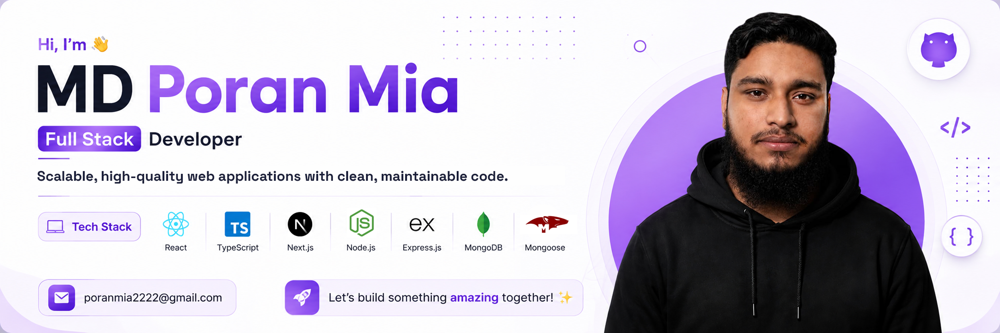

  

<h1 align="center">
  Hi there, I'm Md. Poran Mia 
</h1>

  

  
  
  

---

### 👨‍💻 About Me

I'm a **Full-Stack Web Developer** focused on building fast, scalable, and user-friendly web applications with the **MERN stack**. I started out as a **Graphic Designer in 2018**, and that design background now shapes how I approach every product I build — clean, intentional, and detail-driven.

- 🔭 **Currently building:** projects with React.js, Next.js & TypeScript
- 🌱 **Currently exploring:** advanced Node.js, Express.js & MongoDB patterns
- 🧠 **Currently sharpening:** JavaScript, TypeScript & problem solving
- 🎯 **Focused on:** clean code, performance, and thoughtful UI/UX
- 🎨 **Background in:** graphic design (Photoshop, Illustrator, Figma)
- 💬 **Ask me about:** React, Node.js, Express, MongoDB, UI/UX
- 📫 **Reach me at:** [poranmia2222@gmail.com](mailto:poranmia2222@gmail.com)

---

### 🚀 Tech Stack

<table align="center"> <tr> <td align="center" valign="top" width="33%">

💻 Languages & Frontend    

</td> <td align="center" valign="top" width="33%">

⚙️ Backend & Databases    

</td> <td align="center" valign="top" width="33%">

🧰 Tools & Design      

</td> </tr> </table>  

---

### 📊 GitHub Analytics

  
  

  

---

### 🐍 Contribution Snake

  

---

<h3 align="center">🤝 Let's Connect</h3>

  
  

  <i>💡 Always learning, building, and improving.</i>

